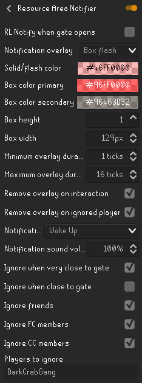

# Resource Area Notifier
**Resource area notifier notifies the user when the gate in the wilderness Resource Area opens**, with a decent amount of customizability regarding notification overlay/sound. 

**This plugin adds the following features:**
- Add a RuneLite notification.
- Add customizable notification overlays such as box solid or box flash.
- Choose custom notification sounds.
- Ignore friends/FC members/CC members/other players.
- The custom notification overlay will be displayed and the audio notification will be played when you change the respective config settings. This allows the user to preview their settings. Keep in mind that you might have to temporarily disable 'Remove overlay on ignored player' when testing overlay config changes in the resource area, or the preview of the overlay will likely be removed immediately after the minimum duration set in the config.

 

## Additional info
Please note that this plugin does **not** provide the user with any information that would otherwise not be available to them!

If you experience any issues or have any concerns, please reach out to YvesW via a GitHub Issue, by Discord direct messaging or via the RuneLite Discord by mentioning @Yves W.

Thanks to [m0bilebtw](https://github.com/m0bilebtw) for the SoundEngine and SoundFileManager code! They've only been slightly adjusted.

## Changelog

xx-xxxx:
- No changes yet!

### Audio copyright notices / attributions / disclaimers
- The Wake Up ("[Wake Up](https://directory.audio/sound-effects/interface-ui/20324-notification-wake-up)") audio clip has been provided by [freesman](https://directory.audio/authoritems/671-freesman) (2023) and is licensed under [Creative Commons CC0](https://creativecommons.org/public-domain/cc0/). Silences at the beginning and the end have been trimmed.
- The Badoob ("[UI notification 1](https://directory.audio/sound-effects/interface-ui/15930-ui-notification-1)") audio clip has been provided by [freesman](https://directory.audio/authoritems/671-freesman) (2021) and is licensed under [Creative Commons CC0](https://creativecommons.org/public-domain/cc0/). Silences at the beginning and the end have been trimmed.
- The RPG Level Up ("[New Level Notification](https://directory.audio/sound-effects/interface-ui/15923-new-level-notification)") audio clip has been provided by [freesman](https://directory.audio/authoritems/671-freesman) (2021) and is licensed under [Creative Commons CC0](https://creativecommons.org/public-domain/cc0/). Silences at the beginning and the end have been trimmed.
- The RPG Open Chest ("[New Level Notification 2](https://directory.audio/sound-effects/interface-ui/15924-new-level-notification-2)") audio clip has been provided by [freesman](https://directory.audio/authoritems/671-freesman) (2021) and is licensed under [Creative Commons CC0](https://creativecommons.org/public-domain/cc0/). Silences at the beginning and the end have been trimmed.
- The Attention ("[Incoming message notification in chat 05](https://directory.audio/sound-effects/interface-ui/17059-incoming-message-notification-in-chat-05)") audio clip has been provided by [freesman](https://directory.audio/authoritems/671-freesman) (2022) and is licensed under [Creative Commons CC0](https://creativecommons.org/public-domain/cc0/). Silences at the beginning and the end have been trimmed.
- The Select ("[Select click](https://directory.audio/sound-effects/interface-ui/16691-select-click)") audio clip has been provided by [freesman](https://directory.audio/authoritems/671-freesman) (2022) and is licensed under [Creative Commons CC0](https://creativecommons.org/public-domain/cc0/). Silences at the beginning and the end have been trimmed.
- The Start Game ("[Software Interface Start](https://directory.audio/sound-effects/interface-ui/16771-software-interface-start)") audio clip has been provided by [freesman](https://directory.audio/authoritems/671-freesman) (2022) and is licensed under [Creative Commons CC0](https://creativecommons.org/public-domain/cc0/). Silences at the beginning and the end have been trimmed.
- The Strum ("[Notification "Strum"](https://directory.audio/sound-effects/interface-ui/17514-notification-strum)") audio clip has been provided by [freesman](https://directory.audio/authoritems/671-freesman) (2022) and is licensed under [Creative Commons CC0](https://creativecommons.org/public-domain/cc0/). Silences at the beginning and the end have been trimmed.
- The Dink Donk ("[Short notification](https://directory.audio/sound-effects/interface-ui/15906-short-notification)") audio clip has been provided by [freesman](https://directory.audio/authoritems/671-freesman) (2021) and is licensed under [Creative Commons CC0](https://creativecommons.org/public-domain/cc0/). Silences at the beginning and the end have been trimmed.
- The Task Completed ("[Notification "All tasks completed"](https://directory.audio/sound-effects/interface-ui/20320-notification-all-tasks-completed)") audio clip has been provided by [freesman](https://directory.audio/authoritems/671-freesman) (2023) and is licensed under [Creative Commons CC0](https://creativecommons.org/public-domain/cc0/). Silences at the beginning and the end have been trimmed.
- The Beep Boop ("[Beep Boop Notification](https://directory.audio/sound-effects/interface-ui/16323-beep-boop-notification)") audio clip has been provided by [freesman](https://directory.audio/authoritems/671-freesman) (2021) and is licensed under [Creative Commons CC0](https://creativecommons.org/public-domain/cc0/). Silences at the beginning and the end have been trimmed.
- The Bright Bell ("[Bright Bell Notification](https://directory.audio/sound-effects/interface-ui/16782-bright-bell-notification)") audio clip has been provided by [freesman](https://directory.audio/authoritems/671-freesman) (2022) and is licensed under [Creative Commons CC0](https://creativecommons.org/public-domain/cc0/). Silences at the beginning and the end have been trimmed.
- The Wazoop ("[Phone notification](https://directory.audio/sound-effects/interface-ui/15913-phone-notification)") audio clip has been provided by [freesman](https://directory.audio/authoritems/671-freesman) (2021) and is licensed under [Creative Commons CC0](https://creativecommons.org/public-domain/cc0/). Silences at the beginning and the end have been trimmed.
- The Chime ("[Notification "Chime"](https://directory.audio/sound-effects/interface-ui/17497-notification-chime)") audio clip has been provided by [freesman](https://directory.audio/authoritems/671-freesman) (2022) and is licensed under [Creative Commons CC0](https://creativecommons.org/public-domain/cc0/). Silences at the beginning and the end have been trimmed.
- The Page Forward Chime ("[Page Forward Single Chime](https://directory.audio/sound-effects/interface-ui/16752-page-forward-single-chime)") audio clip has been provided by [freesman](https://directory.audio/authoritems/671-freesman) (2022) and is licensed under [Creative Commons CC0](https://creativecommons.org/public-domain/cc0/). Silences at the beginning and the end have been trimmed.
- The Go Back ("[Software Interface Back](https://directory.audio/sound-effects/interface-ui/16764-software-interface-back)") audio clip has been provided by [freesman](https://directory.audio/authoritems/671-freesman) (2022) and is licensed under [Creative Commons CC0](https://creativecommons.org/public-domain/cc0/). Silences at the beginning and the end have been trimmed.
- The Picked Coin Echo ("[Picked Coin Echo](https://ccmixter.org/files/NenadSimic/40456)") audio clip has been provided by [NenadSimic](https://ccmixter.org/people/NenadSimic) (2012) and is licensed under [Creative Commons Attribution (3.0)](https://creativecommons.org/licenses/by/3.0/). Silences at the beginning and the end have been trimmed. The licensor does not endorse the creator of this plugin or its use.
- The Ice and Chili ("[Ice and Chilli](https://ccmixter.org/files/_ghost/22043)") audio clip has been provided by [_ghost](https://ccmixter.org/people/_ghost) (2009) and is licensed under [Creative Commons Noncommercial Sampling Plus](https://creativecommons.org/licenses/nc-sampling+/1.0/). The track has been cut and faded out. The licensor does not endorse the creator of this plugin or its use. It is NOT used for commercial purposes.
- The Stop Blue ("["Stop" (blue mix)](https://ccmixter.org/files/Ghost_k/8721)") audio clip has been provided by [Ghost_k (Ghost Kollective)](https://ccmixter.org/people/Ghost_k) (2007) and is licensed under [Creative Commons Attribution (2.5 Generic)](https://creativecommons.org/licenses/by/2.5/). The track has been cut and faded out. The licensor does not endorse the creator of this plugin or its use.
- The Call You ("[I CAN FINALLY CALL YOU](https://ccmixter.org/files/BOCrew/67168)") audio clip has been provided by [Bocrew](https://ccmixter.org/people/BOCrew) (2023) and is licensed under [Creative Commons Attribution-NonCommercial (3.0 Unported)](https://creativecommons.org/licenses/by-nc/3.0/). The track has been cut and faded out. The licensor does not endorse the creator of this plugin or its use. It is NOT used for commercial purposes.
- The Hold Me Back ("[H O L D M E B A C K](https://ccmixter.org/files/thatcrazylittleasian/66880)") audio clip has been provided by [SO SHA](https://ccmixter.org/people/thatcrazylittleasian) (2023) and is licensed under [Creative Commons Attribution-NonCommercial (4.0 International)](https://creativecommons.org/licenses/by-nc/4.0/). The track has been cut and faded out. The licensor does not endorse the creator of this plugin or its use. It is NOT used for commercial purposes.
- The Slow Week ("[Slow Week](https://ccmixter.org/files/Hieron/67067)") audio clip has been provided by [Hieron](https://ccmixter.org/people/Hieron) (2023) and is licensed under [Creative Commons Attribution (4.0 International)](https://creativecommons.org/licenses/by/4.0/). The track has been cut and faded out. The licensor does not endorse the creator of this plugin or its use.

If you find a good track/audio clip licensed under e.g. Creative Commons, feel free to let me know. I might add it as notification sound.